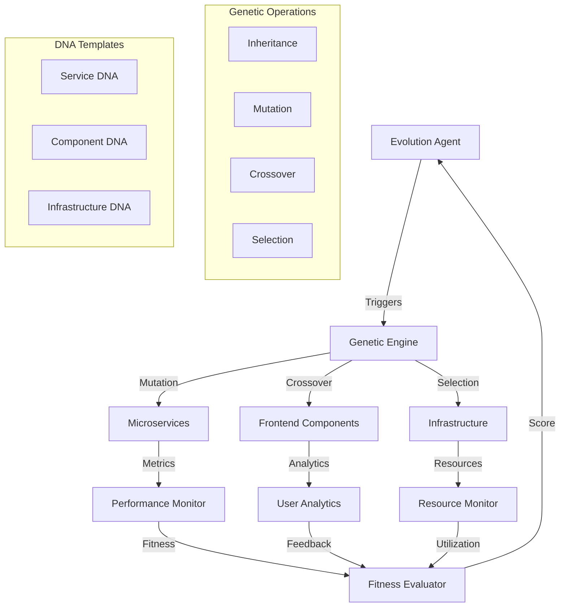

# Genetic Coding Architecture

## Overview

TravelHub implements a revolutionary genetic coding architecture where software components evolve and adapt automatically based on performance metrics, user feedback, and environmental pressures.

## Core Principles

### 1. Everything Has DNA
Every component in the system has genetic DNA that defines:
- **Behavioral Traits**: How the component behaves
- **Performance Characteristics**: Expected performance metrics
- **Evolution Capabilities**: How it can adapt and change
- **Fitness Criteria**: What makes it successful

### 2. Continuous Evolution
Components continuously evolve through:
- **Real-time Monitoring**: Constant performance tracking
- **Fitness Evaluation**: Regular assessment of success metrics
- **Genetic Operations**: Inheritance, mutation, crossover, selection
- **Automatic Deployment**: Evolved components automatically replace older versions

### 3. Multi-Agent Collaboration
Specialized agents work together:
- **Architecture Agent**: Designs system patterns
- **Backend Agent**: Develops microservices
- **Frontend Agent**: Creates UI components
- **Database Agent**: Optimizes data structures
- **DevOps Agent**: Manages infrastructure
- **Testing Agent**: Ensures quality

## System Architecture



## Evolution Workflow

### 1. Monitoring Phase
- Collect performance metrics
- Gather user feedback
- Monitor resource utilization
- Track error rates and availability

### 2. Fitness Evaluation
- Calculate fitness scores for all components
- Identify underperforming elements
- Determine evolution triggers

### 3. Genetic Operations

#### Inheritance
```typescript
// Service inherits successful patterns from parent
const childService = await evolutionEngine.inherit(
  parentServiceDNA,
  ['caching_strategy', 'error_handling'],
  evolutionContext
);
```

#### Mutation
```typescript
// Random improvements based on performance pressure
const mutatedService = await evolutionEngine.mutate(
  currentServiceDNA,
  ['performance_pressure', 'security_enhancement'],
  mutationRate: 0.1
);
```

#### Crossover
```typescript
// Combine successful traits from two services
const hybridService = await evolutionEngine.crossover(
  highPerformanceService,
  highSecurityService,
  ['auth_patterns', 'caching_strategy']
);
```

#### Selection
```typescript
// Keep only the fittest variants
const survivors = await evolutionEngine.selectFittest(
  servicePopulation,
  selectionRate: 0.7
);
```

### 4. Testing & Validation
- Run genetic test suites
- Validate fitness improvements
- Ensure backward compatibility
- Performance regression testing

### 5. Deployment
- Blue-green deployment of evolved components
- Canary releases with fitness monitoring
- Automatic rollback on fitness decline
- Real-time evolution tracking

## DNA Structure Examples

### Service DNA
```yaml
serviceId: "user-service"
serviceType: "CRUD"
version: "1.2.3"
generation: 15

patterns:
  - "Repository"
  - "Circuit Breaker"
  - "Retry"

performance:
  targetResponseTime: 50  # evolved from 100ms
  targetThroughput: 2000  # evolved from 1000rps
  targetAvailability: 99.95

evolution:
  apiVersioning: true
  cachingEnabled: true    # evolved trait
  circuitBreakerEnabled: true  # evolved trait
  retryMechanism: true    # evolved trait

fitnessHistory:
  - generation: 1
    fitness: 0.65
  - generation: 15
    fitness: 0.94  # significant improvement
```

### Component DNA
```yaml
componentId: "flight-search"
componentType: "Component"
version: "2.1.0"
generation: 8

optimization:
  lazyLoading: true       # evolved trait
  memoization: true       # evolved trait
  virtualization: true    # evolved trait
  codesplitting: true

a11y:
  semanticHTML: true
  ariaLabels: true
  keyboardNavigation: true
  screenReaderSupport: true
  colorContrast: true     # evolved trait
  focusManagement: true   # evolved trait

performance:
  renderTime: 45          # evolved from 100ms
  bundleSize: 35          # evolved from 50KB
  accessibilityScore: 98  # evolved from 85
  lighthouseScore: 95     # evolved from 80
```

## Evolution Triggers

### Performance Triggers
- Response time > target + 50%
- Throughput < target - 20%
- Error rate > 1%
- Resource usage > 85%

### User Experience Triggers
- User satisfaction < 4.0/5.0
- Task completion rate < 85%
- Accessibility score < 90
- Usability feedback decline

### Security Triggers
- New vulnerability detected
- Security score < 95
- Compliance failure
- Penetration test failure

### Business Triggers
- Cost per transaction increase
- Revenue impact detected
- SLA violations
- Customer churn correlation

## Evolution Success Stories

### Case Study 1: User Service Evolution
**Generation 1**: Basic CRUD operations (Fitness: 0.65)
- Response time: 150ms
- No caching
- Basic error handling

**Generation 15**: Highly optimized service (Fitness: 0.94)
- Response time: 45ms (70% improvement)
- Redis caching with intelligent invalidation
- Circuit breaker with fallback strategies
- Advanced monitoring and alerting

**Key Evolutions**:
1. **Gen 3**: Added Redis caching (15% performance boost)
2. **Gen 7**: Implemented circuit breaker (99.9% → 99.95% availability)
3. **Gen 12**: Query optimization (30% faster database operations)
4. **Gen 15**: Connection pooling refinement (final 10% improvement)

### Case Study 2: Flight Search Component Evolution
**Generation 1**: Basic search form (Fitness: 0.58)
- Render time: 120ms
- No lazy loading
- Basic accessibility

**Generation 8**: Adaptive search interface (Fitness: 0.91)
- Render time: 45ms (62% improvement)
- Smart lazy loading based on user patterns
- AI-powered search suggestions
- Advanced accessibility features

**Key Evolutions**:
1. **Gen 2**: Implemented memoization (20% render time improvement)
2. **Gen 4**: Added lazy loading (40% bundle size reduction)
3. **Gen 6**: Enhanced accessibility (85 → 98 accessibility score)
4. **Gen 8**: User pattern learning (personalized search experience)

## Benefits of Genetic Architecture

### Automatic Optimization
- No manual performance tuning required
- Continuous improvement without human intervention
- Adaptive responses to changing conditions

### Self-Healing Systems
- Automatic recovery from performance degradation
- Evolutionary response to new threats
- Resilience through genetic diversity

### Innovation Through Evolution
- Unexpected optimizations discovered through mutation
- Novel solutions through genetic crossover
- Emergent behaviors from complex interactions

### Competitive Advantage
- Faster adaptation to market changes
- Continuous improvement without development overhead
- Superior performance through evolutionary pressure

## Future Roadmap

### Phase 1: Enhanced Intelligence (Q3 2025)
- Machine learning integration for smarter mutations
- Predictive evolution based on usage patterns
- Advanced fitness functions with business metrics

### Phase 2: Cross-System Evolution (Q4 2025)
- Evolution across different technology stacks
- Inter-service genetic communication
- Ecosystem-wide optimization

### Phase 3: Autonomous Architecture (Q1 2026)
- Self-designing system architecture
- Autonomous technology selection
- Evolutionary infrastructure provisioning